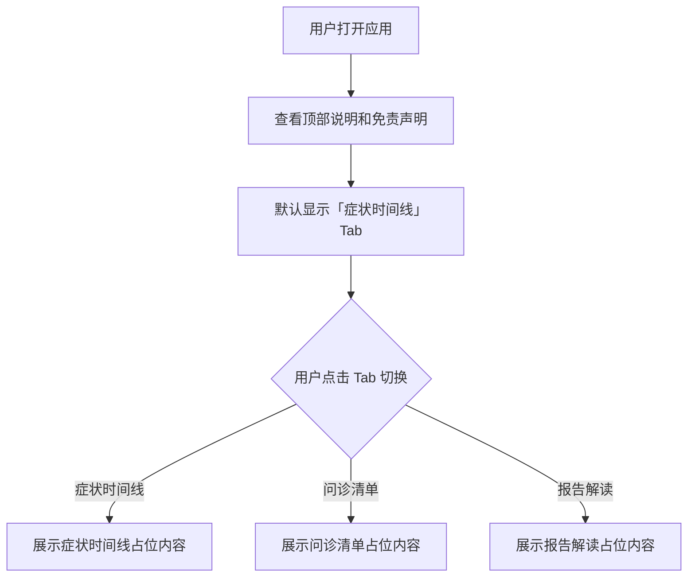

## 1. 产品概述

「陪诊锦囊 MedPrep」是一款移动端优先的就医辅助工具，帮助患者（尤其是中老年人）在就诊前整理症状时间线、准备问诊问题、以及解读检查报告。本工具不提供医疗诊断，仅帮助用户整理就诊信息，提升就医效率。

- **目标用户**：需要就诊的患者及其家属，特别关注中老年用户的使用体验
- **核心价值**：让患者在就诊时能够清晰、有条理地向医生传达关键信息，避免遗漏

## 2. 核心功能

### 2.1 用户角色

无需注册登录，打开即用，所有数据存储在浏览器本地。

### 2.2 功能模块

1. **症状时间线**：按时间顺序记录症状变化，帮助医生了解病情发展过程
2. **问诊清单**：列出就诊时需要询问医生的问题清单，支持勾选已问
3. **报告解读**：粘贴或上传检查报告，获取通俗易懂的指标说明

### 2.3 页面详情

| 页面名称 | 模块名称 | 功能描述 |
|---------|---------|---------|
| 主页面 | 顶部说明区 | 展示产品名称、简短说明及免责声明 |
| 主页面 | Tab 导航栏 | 三个 Tab 切换：「症状时间线」「问诊清单」「报告解读」 |
| 主页面 | 症状时间线 | 占位内容：提示用户添加症状记录，按时间线展示 |
| 主页面 | 问诊清单 | 占位内容：展示待问问题列表，支持勾选 |
| 主页面 | 报告解读 | 占位内容：文本输入区域，等待后续功能实现 |

## 3. 核心流程

## 4. 用户界面设计

### 4.1 设计风格

- **主色调**：暖橙色（#F97316）作为主色，搭配暖米色（#FFF7ED）背景，营造温暖、可信赖的医疗辅助氛围
- **辅助色**：柔和绿色（#22C55E）用于完成/确认状态，柔和蓝色（#3B82F6）用于链接和信息提示
- **按钮样式**：大圆角按钮（rounded-2xl），最小高度 48px，适合中老年人点击
- **字体与字号**：使用系统默认中文字体，正文字号 text-lg（18px），标题字号 text-2xl（24px），确保中老年人能清晰阅读
- **布局风格**：卡片式布局，圆角卡片（rounded-2xl），柔和阴影，上下滚动
- **图标**：使用 lucide-react 图标库

### 4.2 页面设计概览

| 页面名称 | 模块名称 | UI 元素 |
|---------|---------|--------|
| 主页面 | 顶部 Header | 产品名称「陪诊锦囊」+ 副标题，暖橙色渐变背景，圆角底部 |
| 主页面 | 免责声明 | 浅黄色背景卡片，小号字体，感叹号图标 |
| 主页面 | Tab 导航 | 三个等宽 Tab 按钮，选中态暖橙色底色 + 白色文字，未选中态灰色文字 |
| 主页面 | 功能内容区 | 白色圆角卡片容器，内边距充足，大号占位图标 + 说明文字 |

### 4.3 响应式设计

- 移动端优先：最大宽度 480px，居中显示
- 平板及以上：适当放宽内容宽度，添加两侧留白
- 所有交互元素最小触摸区域 44×44px