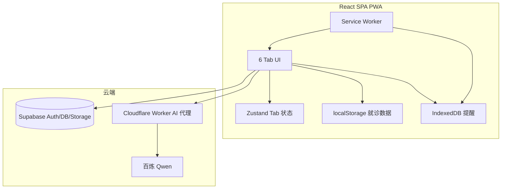

# 陪诊锦囊 MedPrep — 技术架构 v2.0

---

## 1. 总体架构



---

## 2. 技术栈

| 层 | 技术 |
|----|------|
| 前端 | React 18 + TypeScript + Vite 6 |
| 样式 | Tailwind CSS 3 |
| 状态 | Zustand |
| 路由 | React Router HashRouter |
| PWA | vite-plugin-pwa + Workbox |
| 本地提醒 | idb (IndexedDB) |
| 后端 | Supabase（Auth + PostgreSQL + Storage） |
| AI | Cloudflare Worker → 百炼 DashScope |

---

## 3. 目录结构

```
src/
├── pages/           Home, Login, History, HistoryDetail, Settings, PrintView
├── components/      6 Tab 组件 + ShareView + PWA/提醒组件
├── services/        visitService, shareService, llmService,
│                    medicationReminderService, followUpReminderService,
│                    notificationService
├── utils/           解析器、visitStore、shareUtils
├── contexts/        AuthContext
├── store/           useTabStore
└── lib/             supabaseClient
worker/              AI 代理
supabase/            setup SQL + migrations
e2e/                 Playwright 测试
tests/               单元测试
```

---

## 4. 数据模型

### 4.1 VisitData（localStorage `medprep_current_visit`）

- timeline / checklist / report / postVisit

### 4.2 MedicationReminder（IndexedDB `medprep-reminders`）

```typescript
interface MedicationReminder {
  id: string
  name: string
  dosage: string
  notes: string
  times: string[]       // HH:mm
  startDate: string
  endDate?: string
  takenLog: { date, time, taken }[]
  enabled: boolean
}
```

### 4.3 FollowUpReminder（IndexedDB `medprep-followups`）

```typescript
interface FollowUpReminder {
  id: string
  condition: string
  items: string
  dueDate: string
  remindDaysBefore: number[]
  enabled: boolean
}
```

### 4.4 Supabase 表

- `profiles` / `visits` / `shares`
- shares：公开读，**仅登录用户可 INSERT**
- `cleanup_expired_shares()` 清理 7 天前数据

---

## 5. 部署与环境变量

| 变量 | 用途 |
|------|------|
| `VITE_SUPABASE_URL` | Supabase 项目 |
| `VITE_SUPABASE_ANON_KEY` | 匿名 Key |
| `VITE_AI_PROXY_URL` | Worker URL |
| `VITE_APP_URL` | 分享短链根 URL（可选，默认运行时 origin） |
| `BAILIAN_API_KEY` | Worker Secret |
| `ALLOWED_ORIGINS` | Worker CORS 白名单（可选） |

部署目标：Vercel / GitHub Pages + 独立 Worker。

---

## 6. PWA 与通知

- `vite-plugin-pwa` 生成 SW，预缓存静态资源
- `notificationService.syncDueReminders()`：每分钟 + 页面可见时检查
- iOS 降级：App 内「今日用药」为主路径
- `InstallPrompt`：引导添加到主屏幕

---

## 7. 测试

- `npm run test:unit` — 提醒逻辑单元测试
- `npm run test:e2e` — Playwright 端到端
- `npm run check` — TypeScript
- `npm run build` — 生产构建
