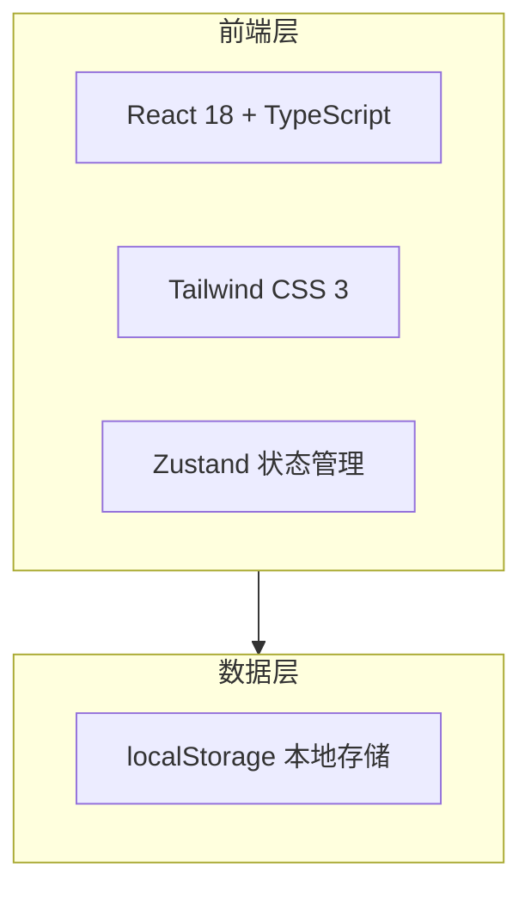

## 1. 架构设计



## 2. 技术说明

- **前端框架**：React 18 + TypeScript
- **样式方案**：Tailwind CSS 3
- **构建工具**：Vite
- **初始化工具**：vite-init（react-ts 模板）
- **状态管理**：Zustand（管理当前 Tab 选中状态）
- **图标库**：lucide-react
- **后端**：无（纯前端应用）
- **数据存储**：localStorage（当前阶段使用占位内容，后续实现数据持久化）

## 3. 路由定义

本项目为单页应用，无需路由，使用 Tab 切换实现三个功能区的展示。

## 4. 组件结构

```
src/
├── App.tsx                    # 根组件，组装整体布局
├── main.tsx                   # 入口文件
├── index.css                  # 全局样式 + Tailwind 指令
├── components/
│   ├── Header.tsx             # 顶部产品说明 + 免责声明
│   ├── TabBar.tsx             # Tab 导航栏
│   ├── SymptomTimeline.tsx    # 症状时间线占位
│   ├── ConsultChecklist.tsx   # 问诊清单占位
│   └── ReportReader.tsx       # 报告解读占位
└── store/
    └── useTabStore.ts         # Tab 状态管理
```

## 5. 数据模型

当前阶段为占位内容，无需数据模型。后续迭代时定义：

- 症状记录：{ id, date, symptom, description, severity }
- 问诊问题：{ id, question, isAsked }
- 报告记录：{ id, date, title, content }