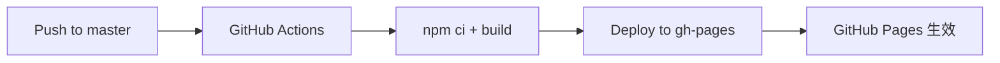

# 陪诊锦囊 MedPrep

> 帮您整理就诊信息，让每一次问诊更从容

[](https://github.com/ShuoMeng66/MedPrep/actions/workflows/deploy.yml)
[](LICENSE)
[](https://react.dev/)
[](https://www.typescriptlang.org/)
[](https://vitejs.dev/)
[](https://tailwindcss.com/)

**陪诊锦囊 MedPrep** 是一款面向中老年患者及家属的移动端就医辅助工具，在就诊前系统整理病情信息，提升问诊效率与沟通质量。

> 本工具仅帮助整理就诊信息，不构成医疗诊断或治疗建议。

---

## 功能

### 症状时间线

自然语言描述症状变化，系统自动识别中文时间标记，生成结构化时间线卡片。

- 支持「上周一」「3天前」「今天」等中文时间表达
- 自动推断严重程度（轻/中/重）
- 一键复制结构化文本，方便分享给医生或家人

### 问诊清单

基于症状描述和科室，自动生成 8–12 条建议向医生提问的问题。

- 四分类：病因排查 / 检查建议 / 用药注意 / 复诊安排
- 每条可单独勾选「已问过」
- 支持导出为文本

### 报告白话解读

上传检查报告图片，输入指标数值，获取通俗易懂的解读。

- 支持 JPG/PNG 图片上传（拖拽或点击），最大 5MB
- 识别 7 种常见报告类型（血常规、肝功能、肾功能、血脂、血糖、甲状腺、尿常规）
- 异常指标用「建议向医生确认」替代吓人措辞
- 自动生成 3 条复诊追问建议

---

## 技术栈

| 类别 | 技术 |
|------|------|
| 框架 | React 18 + TypeScript |
| 构建 | Vite 6 |
| 样式 | Tailwind CSS 3 |
| 状态管理 | Zustand |
| 图标 | Lucide React |
| 路由 | React Router DOM |
| 部署 | GitHub Pages |

---

## 快速开始

```bash
# 克隆仓库
git clone https://github.com/ShuoMeng66/MedPrep.git
cd MedPrep

# 安装依赖
npm install

# 启动开发服务器
npm run dev

# 打开浏览器访问
# http://localhost:5173
```

---

## 项目结构

```
src/
├── main.tsx                          # 入口文件
├── App.tsx                           # 根组件
├── index.css                         # 全局样式 + Tailwind 指令
├── store/
│   └── useTabStore.ts                # Tab 状态管理 (Zustand)
├── pages/
│   └── Home.tsx                      # 主页面
├── components/
│   ├── Header.tsx                    # 顶部品牌区 + 免责声明
│   ├── TabBar.tsx                    # Tab 导航栏
│   ├── SymptomTimeline.tsx           # 症状时间线
│   ├── ConsultChecklist.tsx          # 问诊清单
│   └── ReportReader.tsx              # 报告解读
└── utils/
    ├── timelineParser.ts             # 症状文本解析器
    ├── questionGenerator.ts          # 问题生成引擎
    └── reportInterpreter.ts          # 报告解读引擎
```

---

## 可用脚本

| 命令 | 说明 |
|------|------|
| `npm run dev` | 启动开发服务器 |
| `npm run build` | 生产构建 |
| `npm run preview` | 本地预览构建产物 |
| `npm run check` | TypeScript 类型检查 |

---

## 部署

本项目使用 **GitHub Actions** 自动部署到 GitHub Pages。推送代码到 `master` 分支即可触发自动构建和部署。



### 自动部署

```bash
git add . && git commit -m "..." && git push origin master
# 推送后 GitHub Actions 自动执行构建和部署
```

### 本地构建验证

```bash
npm run build       # 构建到 dist/
npm run preview     # 本地预览构建产物
```

### 部署地址

**在线体验**：[https://shuomeng66.github.io/MedPrep/](https://shuomeng66.github.io/MedPrep/)

> 部署状态可在 [Actions 页面](https://github.com/ShuoMeng66/MedPrep/actions) 查看。

---

## 设计理念

- **移动端优先**：最大宽度 480px，居中显示，适配手机屏幕
- **中老年友好**：大字号（16–18px）、大按钮（最小 48px 触摸区域）、暖色系 UI
- **温暖可信**：暖橙色主色调，圆角卡片，柔和阴影，降低医疗场景的紧张感
- **免责透明**：每个功能区域均标注免责声明，明确工具的辅助定位

---

## License

MIT © 2025