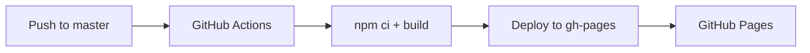

# 陪诊锦囊 MedPrep

> 帮您整理就诊信息，让每一次问诊更从容

[](https://github.com/ShuoMeng66/MedPrep/actions/workflows/deploy.yml)
[](LICENSE)
[](https://react.dev/)
[](https://www.typescriptlang.org/)
[](https://vitejs.dev/)
[](https://tailwindcss.com/)

## 目录

- [项目简介](#项目简介)
- [功能特性](#功能特性)
- [技术栈](#技术栈)
- [快速开始](#快速开始)
- [项目结构](#项目结构)
- [可用脚本](#可用脚本)
- [部署](#部署)
- [设计理念](#设计理念)
- [贡献指南](#贡献指南)
- [License](#license)

## 项目简介

**陪诊锦囊 MedPrep** 是一款面向中老年患者及家属的就医辅助工具，帮助用户在就诊前系统整理病情信息，提升问诊效率与沟通质量。

> [!IMPORTANT]
> 本工具仅用于辅助整理就诊信息，不构成医疗诊断或治疗建议。如有健康问题，请及时就医。

## 功能特性

### 症状时间线

将自然语言描述的症状变化，自动解析为结构化时间线卡片。

- 识别中文时间表达（「上周一」「3 天前」「今天」等）
- 自动推断严重程度（轻 / 中 / 重）
- 一键复制结构化文本，方便分享给医生或家人

### 问诊清单

基于症状描述和就诊科室，自动生成 8–12 条建议向医生提问的问题。

- 四分类：病因排查 / 检查建议 / 用药注意 / 复诊安排
- 每条可单独勾选「已问过」
- 支持导出为文本

### 报告白话解读

上传检查报告图片，输入指标数值，获取通俗易懂的解读。

- 支持 JPG / PNG 图片上传（拖拽或点击），最大 5MB
- 识别 7 种常见报告类型（血常规、肝功能、肾功能、血脂、血糖、甲状腺、尿常规）
- 异常指标使用「建议向医生确认」替代吓人措辞
- 自动生成 3 条复诊追问建议

### 诊后备忘

记录诊后信息，自动生成结构化就诊纪要。

- 四张卡片：医生告知摘要 / 用药清单（表格） / 复查随访 / 观察提醒
- 每张卡片可单独复制，支持「复制全部纪要」和「生成通俗版」
- 数据自动保存到 localStorage

### 就诊包

汇总所有模块数据，生成一份完整的就诊资料单。

- 一键「复制全文」为纯文本（适合微信发送给家人）
- 「打印友好视图」：白底黑字、@media print 优化
- 「保存本次就诊」：快照写入 localStorage 历史记录
- **复诊对比**：从历史记录取上次就诊，对比症状变化、随访完成度，AI 生成建议问题
- **生成分享链接**：将就诊数据压缩编码到 URL hash 中，生成可分享的链接和二维码
- 分享链接打开后为只读视图，顶部提示「家人分享的就诊资料，仅供参考」

## 技术栈

| 类别 | 技术 |
|------|------|
| 框架 | React 18 + TypeScript |
| 构建工具 | Vite 6 |
| 样式方案 | Tailwind CSS 3 |
| 状态管理 | Zustand |
| 图标库 | Lucide React |
| 路由 | React Router DOM |
| 数据压缩 | lz-string |
| 二维码 | qrcode.react |
| 部署平台 | GitHub Pages / Vercel |

## 快速开始

### 环境要求

- Node.js >= 18
- npm >= 9

### 本地开发

```bash
# 克隆仓库
git clone https://github.com/ShuoMeng66/MedPrep.git
cd MedPrep

# 安装依赖
npm install

# 启动开发服务器
npm run dev
```

浏览器访问 `http://localhost:5173` 即可查看。

## 项目结构

```
src/
├── main.tsx                    # 应用入口
├── App.tsx                     # 根组件（路由配置）
├── index.css                   # 全局样式 + Tailwind 指令
├── store/
│   └── useTabStore.ts          # Tab 状态管理（Zustand）
├── pages/
│   └── Home.tsx                # 主页面
├── components/
│   ├── Header.tsx              # 顶部品牌区 + 免责声明
│   ├── TabBar.tsx              # 功能导航栏
│   ├── SymptomTimeline.tsx     # 症状时间线
│   ├── ConsultChecklist.tsx    # 问诊清单
│   ├── ReportReader.tsx        # 报告解读
│   ├── PostVisitMemo.tsx       # 诊后备忘
│   ├── VisitPack.tsx           # 就诊包（汇总 + 复诊对比 + 分享）
│   └── ShareView.tsx           # 分享链接只读视图
└── utils/
    ├── timelineParser.ts       # 症状文本解析器
    ├── questionGenerator.ts    # 问题生成引擎
    ├── reportInterpreter.ts    # 报告解读引擎
    ├── postVisitParser.ts      # 诊后文本解析器
    ├── visitStore.ts           # localStorage 统一读写
    ├── compareVisits.ts        # 复诊对比引擎
    └── shareUtils.ts           # 分享链接编码/解码

## 可用脚本

| 命令 | 说明 |
|------|------|
| `npm run dev` | 启动开发服务器（热更新） |
| `npm run build` | TypeScript 检查 + 生产构建 |
| `npm run preview` | 本地预览构建产物 |
| `npm run check` | 仅运行 TypeScript 类型检查 |

## 部署

### Vercel（推荐 · 国内访问友好）

Vercel 在亚太地区有边缘节点，国内访问速度优于 GitHub Pages。

1. 打开 [vercel.com/new](https://vercel.com/new)
2. 点击 **Import** → 选择 **GitHub** → 授权并选择 `ShuoMeng66/MedPrep`
3. Vercel 自动识别 Vite 框架，无需额外配置
4. 点击 **Deploy**，约 30 秒完成部署
5. 获得体验链接，格式：`https://medprep-xxx.vercel.app`

> 后续每次 push 到 `master` 分支，Vercel 会自动重新部署。

### GitHub Pages

本项目已配置 GitHub Actions 自动部署。



```bash
git push origin master
# 推送后 GitHub Actions 自动执行构建和部署
```

> 需在仓库 [Pages 设置](https://github.com/ShuoMeng66/MedPrep/settings/pages) 中将 Source 设为 `gh-pages` 分支。

### 部署地址

| 平台 | 地址 | 国内访问 |
|------|------|----------|
| Vercel | `https://medprep-xxx.vercel.app`（部署后获得） | 快 |
| GitHub Pages | [https://shuomeng66.github.io/MedPrep/](https://shuomeng66.github.io/MedPrep/) | 一般 |

> 部署状态可在 [Actions 页面](https://github.com/ShuoMeng66/MedPrep/actions) 查看。

## 设计理念

- **响应式布局** — 从手机到桌面全适配，内容区最大宽度 72rem，兼顾可读性与空间利用
- **中老年友好** — 大字号（16px+）、大按钮（最小 48px 触摸区域）、高对比度配色
- **温暖可信** — 暖橙色主色调，圆角卡片，柔和阴影，降低医疗场景的紧张感
- **免责透明** — 每个功能区域均标注免责声明，明确工具的辅助定位

## 贡献指南

欢迎提交 Issue 和 Pull Request。

1. Fork 本仓库
2. 创建特性分支：`git checkout -b feature/amazing-feature`
3. 提交更改：`git commit -m 'feat: add amazing feature'`
4. 推送到分支：`git push origin feature/amazing-feature`
5. 提交 Pull Request

## License

MIT © 2025